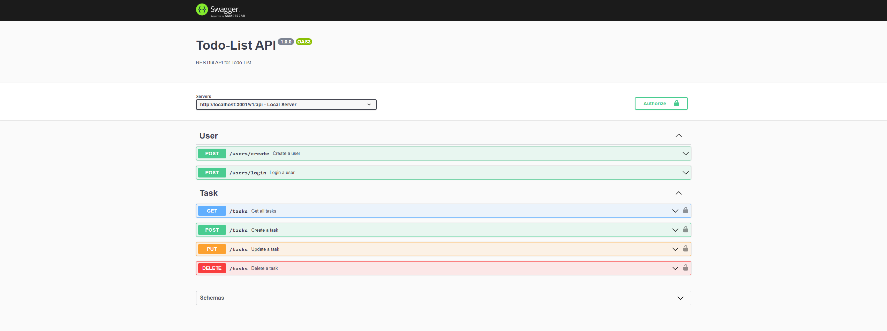

# Todo-List API
A Todo List API é uma aplicação RESTful para a manipulação e leitura de tasks, permitindo operações de CRUD e autenticação via JWT.

## Table de Conteúdos

- [Visão geral](#visão-geral)
  - [O desafio](#o-desafio)
  - [Imagens](#imagens)
  - [Links](#links)
- [Meu processo](#meu-processo)
  - [Construído com](#construído-com)
  - [O que aprendi](#o-que-aprendi)
  - [Recursos úteis](#recursos-úteis)
- [Autor](#autor)

## Visão geral

### O desafio

A Todo List API foi pensada para a prática geral dos conhecimentos sobre uma aplicação em Node.js com Express, cobrindo tópicos como: SOLID, REST, TDD e POO.

__Os usuários devem ser capaz de?__
- Registrar-se e Autenticar-se
- Criar tarefas
- Buscar tarefas
- Atualizar tarefas
- Deletar tarefas
- Consumir a API de qualquer plataforma via HTTP

### Imagens

<small>Documentação da API</small>

### Links

- URL da documentação: https://todo-list-api-417639.herokuapp.com/v1/api-docs/

## Meu processo

### Construído com

- TypeScript
- Node.js
- Express.js
- Prisma
- Postgres
- Mocha, Chai and Sinon
- Swagger

### O que aprendi

Em um primeiro momento pude praticar o TDD como método de desenvolvimento, consolidar meu conhecimento sobre construção de APIs com Node.js e Express e ainda aprender duas novas ferramentas, o Swagger e o Prisma.

Também utilizei esse projeto para praticar e entender os princípios SOLID, o refatorando e deixando seu código mais limpo, organizado e legível.

### Recursos úteis

- [Artigos pessoais sobre Express](https://dev.to/gabrielhsilvestre/series/17270)
- [Artigos pessoais sobre SOLID e POO](https://dev.to/gabrielhsilvestre/series/18165)
- [Documentação Prisma](https://www.prisma.io/docs/)

## Autor

- LinkedIn - [Gabriel Silvestre](https://www.linkedin.com/in/gabrielh-silvestre/)
- DevTo - [Gabriel_Silvestre](https://dev.to/gabrielhsilvestre)